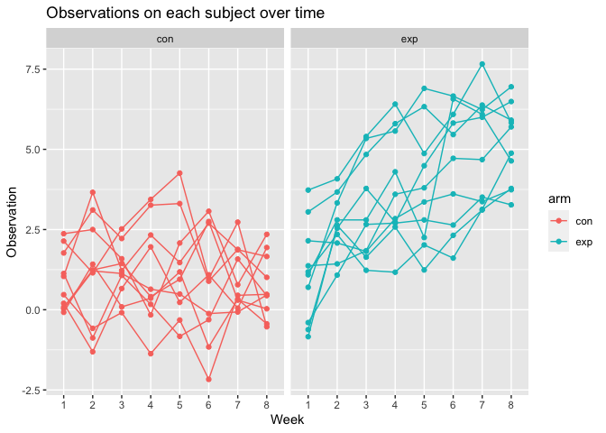

P8105_hw5_sc5154
================
Shaohan Chen
2022-11-16

This is the solution of P8105 Data Science Homework5.

``` r
library(tidyverse)
```

## Problem 1

The goal of this problem is:

Create a tidy dataframe containing data from all participants, including
the subject ID, arm, and observations over time.  
Then we make a spaghetti plot showing observations on each subject over
time, and comment on differences between groups.

Let’s start with loading the dataset.

``` r
df = 
  tibble(
    file_name = list.files("./data/"),
    file_path = str_c("./data/", file_name)
   ) %>%
  mutate(data = map(file_path, read_csv)) %>%
  unnest()
## Warning: `cols` is now required when using unnest().
## Please use `cols = c(data)`
```

Then let’s tidy the dataset.

``` r
df_par = 
  df %>%
  mutate(
    file_name = str_remove(file_name, ".csv"),
  ) %>%
  separate(file_name, into = c("arm", "subject_id"), sep = "_") %>%
  pivot_longer(
    cols = week_1:week_8,
    names_to = "week",
    names_prefix = "week_",
    values_to = "observation"
  )
```

Let’s see how it looks like now

``` r
head(df_par, 5)
## # A tibble: 5 × 5
##   arm   subject_id file_path         week  observation
##   <chr> <chr>      <chr>             <chr>       <dbl>
## 1 con   01         ./data/con_01.csv 1            0.2 
## 2 con   01         ./data/con_01.csv 2           -1.31
## 3 con   01         ./data/con_01.csv 3            0.66
## 4 con   01         ./data/con_01.csv 4            1.96
## 5 con   01         ./data/con_01.csv 5            0.23
```

Next, we make a spaghetti plot showing observations on each subject over
time, and comment on differences between groups.

``` r
df_par %>% 
  ggplot(aes(x = week, 
             y = observation, 
             group = subject_id, color = arm)) +
  geom_point() +
  geom_path() +
  facet_grid(. ~ arm) +
  labs(
    title = "Observations on each subject over time",
    x = "Week",
    y = "Observation"
  )
```

<!-- -->

So we make the plot. Here are some difference between groups: The
experimental arm and control arm have similar average observations level
at the beginning. As time goes by, the control arm keeps to be in the
same level as the initial stage, but the experimental arm increases
roughly linearly over time, and reaches a much higher level than the
control arm.

## Problem 2
